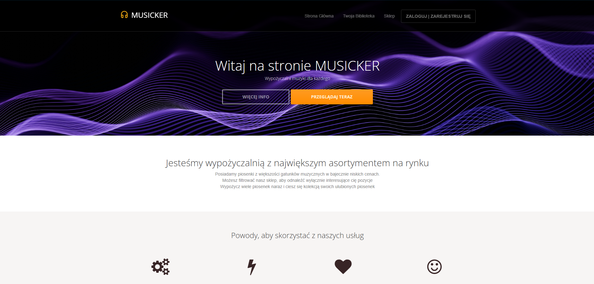
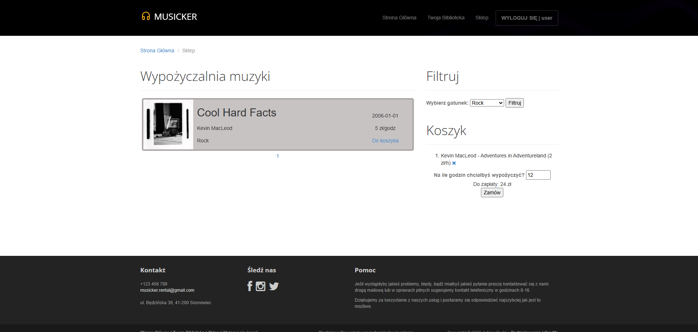
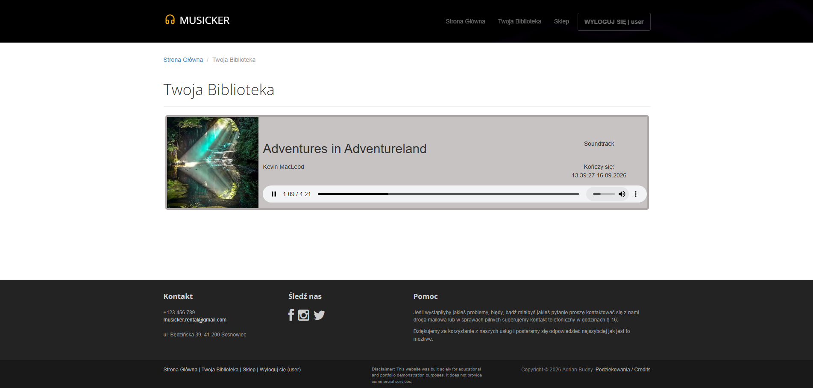
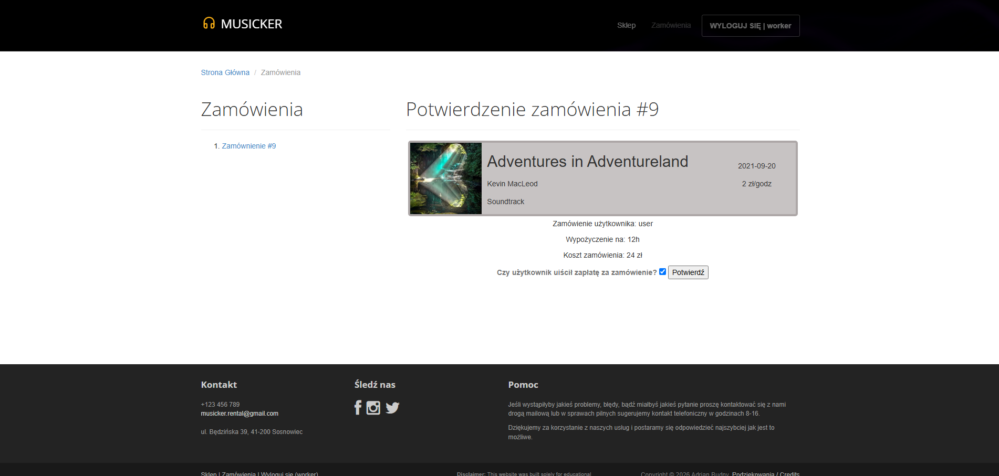
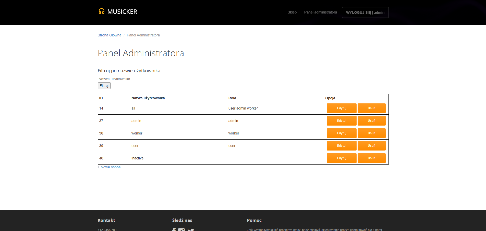
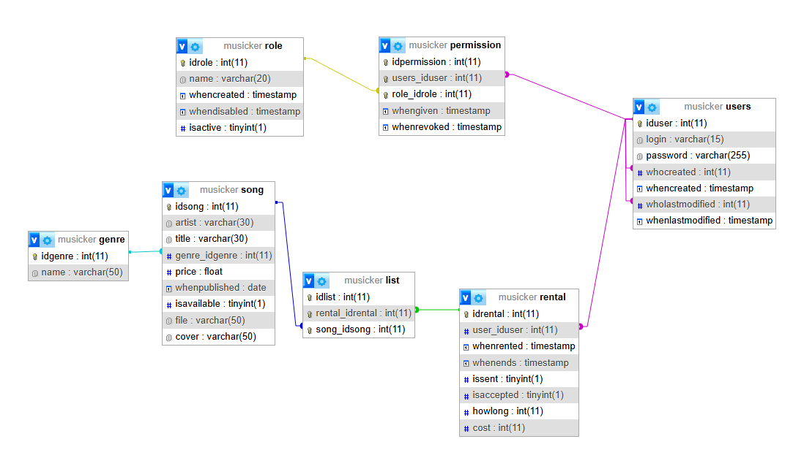

# Musicker - Webowa Wypożyczalnia Muzyki

Internetowa platforma typu pay-per-time umożliwiająca czasowe wypożyczanie utworów muzycznych z wbudowanym odtwarzaczem oraz panelem zarządzania zamówieniami.

---

## O projekcie

**Musicker** to aplikacja webowa realizująca model biznesowy czasowego dostępu do utworów audio (wypożyczalnia na godziny). System zarządza cyklem życia zamówienia: od wyboru utworów z katalogu i określenia czasu trwania licencji, przez manualną weryfikację płatności przez pracowników, aż po automatyczne wygaszanie dostępu po upływie wykupionego czasu.

Aplikacja została zaprojektowana w architekturze MVC z nowatorskim mechanizmem routingu i wstrzykiwania zależności w warstwie rdzennej (`core`).

---

## Kluczowe funkcjonalności

* **Landing Page z Call to Action:** Reprezentacyjna strona powitalna z sekcją Hero, prezentująca model działania serwisu i kierująca do katalogu.
* **Uwierzytelnianie i dynamiczny interfejs:**
  * Moduł rejestracji z podwójną walidacją hasła oraz formularz logowania.
  * Pasek nawigacyjny adaptujący się do stanu sesji (osobny widok dla gościa oraz osobny widok zalogowanego użytkownika z prezentacją bieżącego loginu).
* **Zaawansowany system kontroli dostępu (RBAC):**
  * `Gość / Użytkownik początkowy`: dostęp do strony głównej, podglądu katalogu utworów z filtrowaniem oraz modułu logowania/rejestracji.
  * `User`: katalog utworów z filtrowaniem, koszyk z naliczaniem stawki godzinowej, prywatna biblioteka z odtwarzaczem audio HTML5.
  * `Worker`: podgląd bieżących zamówień, weryfikacja uiszczenia zapłaty i aktywacja licencji czasowej.
  * `Admin`: pełne zarządzanie użytkownikami (CRUD) oraz przypisywanie/odbieranie ról z audytem w bazie danych.
* **Czasowe wypożyczenia:** Mechanizm obliczający ważność licencji (`whenrented`, `whenends`) i blokujący odtwarzanie po upływie czasu.
* **Audyt i integralność bazy:** Śledzenie historii rekordów (`whocreated`, `whencreated`, `wholastmodified`) oraz powiązania relacyjne kluczami obcymi.

---

## Zrzuty ekranu

  
   
  <em>Rysunek 1: Strona główna z sekcją powitalną (Hero Banner) i nawigacją.</em>

 

  
   
  <em>Rysunek 2: Katalog utworów z filtrowaniem gatunków oraz dynamicznym koszykiem.</em>

 

  
   
  <em>Rysunek 3: Biblioteka użytkownika z odtwarzaczami audio i licznikiem ważności wypożyczenia.</em>

 

  
   
  <em>Rysunek 4: Panel pracownika do weryfikacji płatności i akceptacji zamówień.</em>

 

  
   
  <em>Rysunek 5: Panel administracyjny do zarządzania kontami i uprawnieniami RBAC.</em>

---

### Model bazy danych

Projekt wykorzystuje relacyjną strukturę danych zapewniającą pełną integralność oraz śledzenie historii modyfikacji rekordów:

  
   
  <em>Rysunek 6: Schemat relacji tabel (ERD) w bazie danych MySQL/MariaDB.</em>

---

## Technologie i narzędzia

* **Backend:** PHP 8.x (Architektura MVC, OOP)
* **Baza danych / ORM:** MySQL / MariaDB + [Medoo Database Framework](https://medoo.in/) (interfejs PDO)
* **Silnik szablonów:** Smarty Template Engine
* **Frontend:** HTML5 (Audio API), CSS3, JavaScript, Bootstrap 3, FontAwesome
* **Serwer lokalny:** Apache (mod_rewrite zoptymalizowany pod konfigurację `.htaccess`) / XAMPP

---

## Podziękowania / Credits

* **Szablon interfejsu:** projekt oparty na zmodyfikowanym szablonie [Progressus](https://gettemplate.com/) autorstwa Sergeya Pozhilova, udostępnionym na licencji [CC BY 3.0](https://creativecommons.org/licenses/by/3.0/).
* **Grafika w tle (Hero Banner):** grafika autorstwa [A Chosen Soul](https://unsplash.com/@a_chosensoul) z serwisu [Unsplash](https://unsplash.com).
* **Materiały multimedialne (audio i okładki):**
  * *"Cool Hard Facts"* - Kevin MacLeod ([incompetech.com](https://incompetech.com)), licencja: [CC BY 4.0](http://creativecommons.org/licenses/by/4.0/).  
    *Okładka:* zdjęcie autorstwa [Austin](https://unsplash.com/@austin_7792) z serwisu [Unsplash](https://unsplash.com).
  * *"Adventures in Adventureland"* - Kevin MacLeod ([incompetech.com](https://incompetech.com)), licencja: [CC BY 4.0](http://creativecommons.org/licenses/by/4.0/).  
    *Okładka:* zdjęcie autorstwa [Jessica Anderson](https://unsplash.com/@jessica_anderson) z serwisu [Unsplash](https://unsplash.com).
  * *"Raving Energy (faster)"* - Kevin MacLeod ([incompetech.com](https://incompetech.com)), licencja: [CC BY 4.0](http://creativecommons.org/licenses/by/4.0/).  
    *Okładka:* grafika autorstwa [Milad Fakurian](https://unsplash.com/@fakurian) z serwisu [Unsplash](https://unsplash.com).

---

## Licencja / License

**PL:**  
Copyright (c) 2026 Adrian Budny. Wszelkie prawa zastrzeżone.  
Kod źródłowy tego projektu udostępniony jest wyłącznie do wglądu w celach demonstracji portfolio i weryfikacji umiejętności. Kopiowanie, modyfikowanie, rozpowszechnianie lub wykorzystywanie tego kodu w celach komercyjnych lub prywatnych bez pisemnej zgody autora jest zabronione.

**EN:**  
Copyright (c) 2026 Adrian Budny. All rights reserved.  
This source code is made publicly available solely for portfolio demonstration and technical evaluation. No permission is granted to copy, modify, distribute, or use this code for any commercial or non-commercial purpose without prior written consent from the author.
